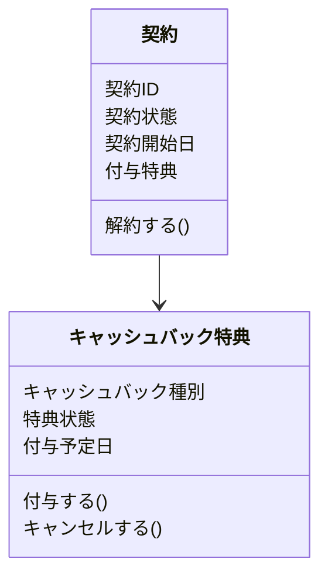
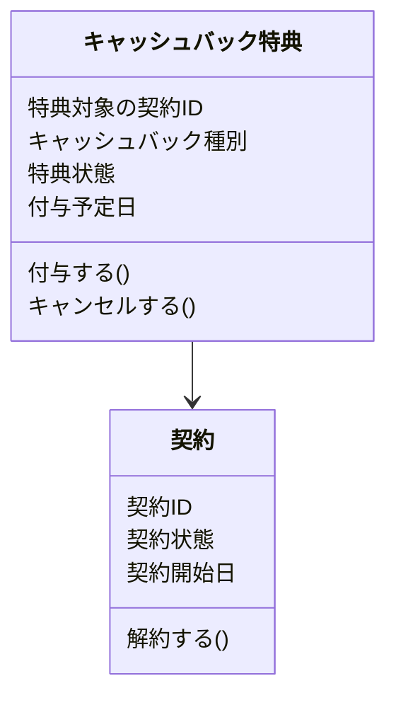

# 契約が特典に依存
## ユースケース
* ユーザが契約を申し込む
* 契約を開始した２年後にユーザが契約中の場合は申し込んだ特典を付与する
* 契約が解約、キャンセルした場合は特典をキャンセルする
* 特典は以下２つ
  * 現金キャッシュバック９０００円
  * 自社サービスに使える商品券１００００円

## モデル
仮に特典と契約の依存関係を契約が特典に依存するモデルにすると以下のようになる。
契約が特典に依存するので、特典は契約を知らなくて良いが、契約が特典に依存するので、特典の操作を契約がしなければいけません。
キャッシュバックの状態を、キャッシュバックまで期日待ちの未キャッシュバック、キャッシュバック済み、そして、期日までに契約をキャンセルしてしまったため、特典を付与しない状態をキャンセルとします。（解約とキャンセルの区別が必要な場合は分けるが、現仕様では不要なためしない）
契約が特典を知るので、契約がどの特典を付与するかしります。

この依存関係の場合は、契約が解約、キャンセルされた場合
契約を解約すると特典もキャンセルしないといけないんですよね。
いくつか書き方あると思いますけど、契約に特典の情報も持たせてみたらこんな感じ。

ようは契約が解約されたら、契約が管理してる特典とかも解約していくロジックなります。
特典が変更されたら契約の影響受けるしくみにはなります。
契約のロジックがこんな感じ
```java
public class CampaignEntity {

    private final CampaignId campaignId;

    private final CampaignStatus campaignStatus;

    private final CampaignType campaignType;

    public CampaignEntity(CampaignId campaignId,
                          CampaignStatus campaignStatus,
                          CampaignType campaignType
    ) {
        this.campaignId=campaignId;
        this.campaignStatus = campaignStatus;
        this.campaignType= campaignType;
    }

    public CampaignEntity cancel(){
        return new CampaignEntity(
                this.campaignId,
                CampaignStatus.CANCELED,
                this.campaignType
        );
    }
}
```

依存関係を逆にした場合、メソッドなどは同じでもいいかなと思う。
特典が自分がどの契約に紐づくいてるか知らないといけないので、契約IDを持たないといけない。
付与する時に契約とあっていればいいあれば、付与する時に契約の状態を確認すれば良いけど、ユーザが特典の状態を確認したい

